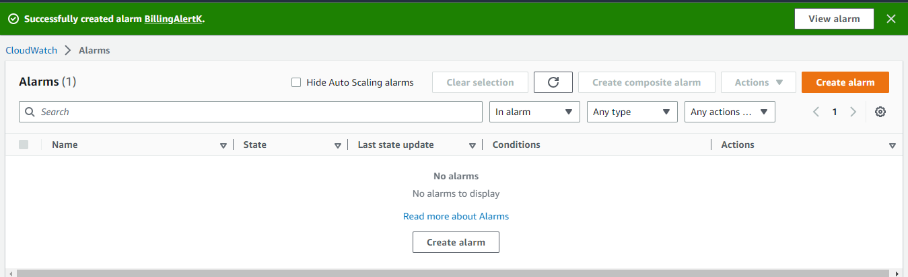
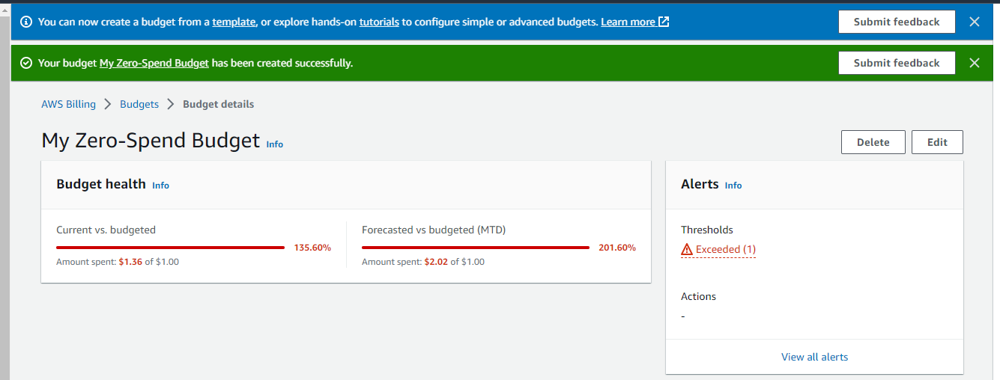

# Week 0 — Billing and Architecture

## Business Scenario

- Your company has asked to put together a technical presentation on the proposed architecture that will be implemented so it can be reviewed by the fractional CTO.
- Your presentation must include a technical architectural diagram and breakdown of possible services used along with their justification.
- The company also wants to generally know what spend we expect to encounter and how we will ensure we keep our spending low.

### CRUDER ?
Blogging app, Ephemeral, cloud native, Targeted to busy professional, no permanent presence online, Time limited

## Architecture
**TOGAF???**
Togaf is an architecture framework that provides the methods and tools for assisting in the acceptance, production, use, and maintenance of an enterprise architecture. It is based on an iterative process model supported by best practices and a re-usable set of existing architecture assets"
* The most popular framework for Enterprose architecture
* Common dictionary of words to convey desired outcomes 
* Meta-model for the creation of the underlying projects 
* Maps closelt to the well architectured tool
### Well Architectured Frameowrk: **6 Pillars?**
1. Operational Exellence
2. Security
3. Reliabilty
4. Performance Efficiency
5. Cost Optimization
6. Sustainability

### Recreate Logical Architectual Diagram in Lucid Charts
[Cruddur Logical Diagram Lucid Chart Link](https://lucid.app/lucidchart/09c65293-0934-455d-8724-812ffd153769/edit?viewport_loc=-204%2C113%2C2493%2C1148%2C0_0&invitationId=inv_ea101dd5-504a-48d4-bd08-97403860066c)

### Logical Diagram
]
### Low Fidelity Conceptual Diagram

## AWS Billing and Free Tier
### Walkthrough
* Billing Dashboard
* Pricing differs with region
* **Creating Billing alarm** :There are two ways of creating a billing alarm
	*  Old  Method :  Billing Preference => Email/Free tier Usage alerts/Recieve Alert
	*  New Method: Cloud watch (Only in northern virginia) =>  Alarms => in alarm => Create alarm => Select metrics => Billing => Total estimated charges => Select metrics=> Metric name/currency/statstics/period/Conditions(Threshold value) => Next => Notification (Email end point) =>Create alarm
### Billing Alarm Created Successfully

*  **Creating budget**:  To create a Budget
	*  Budgets => Create budget => Budget setup /Templates(Monthly)/Name/Budget amount(10$)/Email/
### Zero Spend Alert Created successfully

	
*  **Cost allocation Tags** (Key value pairs)  :A tag is a label that you or AWS assigns to an AWS resource. Each tag consists of a key and a value. For each resource, each tag key must be unique, and each tag key can have only one value. You can use tags to organize your resources, and cost allocation tags to track your AWS costs on a detailed level. After you activate cost allocation tags, AWS uses the cost allocation tags to organize your resource costs on your cost allocation report, to make it easier for you to categorize and track your AWS costs.  To create CaT:  
	*  Go to a Service (EC2) => Tags => Manage tags (Key/Value) => Save => Go to Billing Service => Cost allocation tag => Activate
* 	**Cost Explorer** : AWS Cost Explorer has an easy-to-use interface that lets you visualize, understand, and manage your AWS costs and usage over time. We can use report parameters to  filter our search.
* 	**Report**: The Reports page provides default reports. You can also create new reports with existing templates. The reports include Cost and usage report, Savings Plans utilization report, Savings Plans coverage report, reservation utilization report, and reservation coverage report.
* 	**Credits** AWS credits are applied to bills to help cover costs that are associated with eligible services. Credits are applied until they are exhausted or they expire.
* 	**Aws Pricing Calculator**: Configure a cost estimate that fits your unique business or personal needs with AWS products and services.
* 	**Aws Free Tier**: 
	* 	*Free trials*
	* 	*12 month free*
	* 	*Alway free for all*
	*   Compute = 750 hr per month EC2 (windows and linux t2.micro and t3.micro instances)
	*   Storage = 5Gb of standard storage(20000 GET requests and 2000 Put Request)
	*   Database = 750 hr per month RDS(single_AZ db.t2/t3/t4g.micro instances running MySQL,MariaDB,PostgreSQL. 20 gb general purpose SSD and for backups/snapshots each )
	* 	Database = 25 gb 0f Dynamo db storage (25 WCU and RCU each(Enough to handle 200 requests per month))
	* 	Machine Learning = Amazon SageMaker 2 month free trial
	* 	Compute = 1 million Lambda requests per month (Upto 3.2 million seconds of compute time per month)
	* 	2 Month amazon Redshift Free trial
	* 	750 hours per month of amazon open search service
	* 	[Further services included in Free Tier](https://aws.amazon.com/free/?all-free-tier.sort-by=item.additionalFields.SortRank&all-free-tier.sort-order=asc&awsf.Free%20Tier%20Types=*all&awsf.Free%20Tier%20Categories=*all&awsm.page-all-free-tier=2)

## Security Considerations : Day - 0
* The role of cyber securuty in any organization is to identify and inform the business on any technical risk that the business maybe exposed to.
#### Cloud security 
Cloud security, also known as cloud computing security, is a collection of security measures designed to protect cloud-based infrastructure, applications, and data. These measures ensure user and device authentication, data and resource access control, and data privacy protection.

#### Add MFA to Root User
* Root user = God mode
* MFA - Multi Factor Authentication
* Cloud Shell - Built in CLI to manage infrastructure and edit code online for cloud development.
* SCP - Service control policies (SCPs) are a type of organization policy that you can use to manage permissions in your organization. SCPs offer central control over the maximum available permissions for all accounts in your organization.

For increased security, it is recommend that we configure multi-factor authentication (MFA) to help protect our AWS resources. You can enable MFA for the AWS account root user and IAM users.
[Documentation: How To Enable Multi Factor Authentication For A User](https://docs.aws.amazon.com/IAM/latest/UserGuide/id_credentials_mfa_enable_virtual.html)

#### Aws organizational Units 
You can use organizational units (OUs) to group accounts together to administer as a single unit. This greatly simplifies the management of your accounts.
For example, you can attach a policy-based control to an OU, and all accounts within the OU automatically inherit the policy. You can create multiple OUs within a single organization, and you can create OUs within other OUs. Each OU can contain multiple accounts, and you can move accounts from one OU to another. However, OU names must be unique within a parent OU or root.

[Documentaion: Managing AWS Oraganizational Units](https://docs.aws.amazon.com/organizations/latest/userguide/orgs_manage_ous.html)
 #### AWS CloudTrail
AWS CloudTrail monitors and records account activity across your AWS infrastructure, giving you control over storage, analysis, and remediation actions.

### Cloud Trail log created successfully 

#### AWS IAM Users
An IAM user is a resource in IAM that has associated credentials and permissions. An IAM user can represent a person or an application that uses its credentials to make AWS requests. This is typically referred to as a service account.
#### AWS IAM Roles
AWS Identity and Access Management (IAM) roles are entities you create and assign specific permissions to that allow trusted identities such as workforce identities and applications to perform actions in AWS. When your trusted identities assume IAM roles, they are granted only the permissions scoped by those IAM roles.

IAM Roles manage who has access to your AWS resources, whereas IAM policies control their permissions. A Role with no Policy attached to it won't have to access any AWS resources. A Policy that is not attached to an IAM role is effectively unused.

**The principle of least privilege (PoLP) is an information security concept which maintains that a user or entity should only have access to the specific data, resources and applications needed to complete a required task.**

